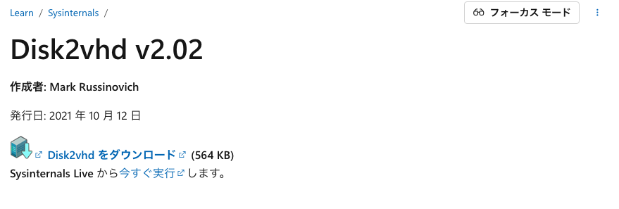
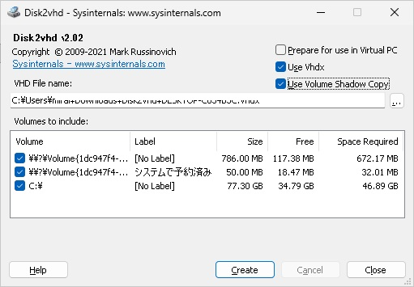
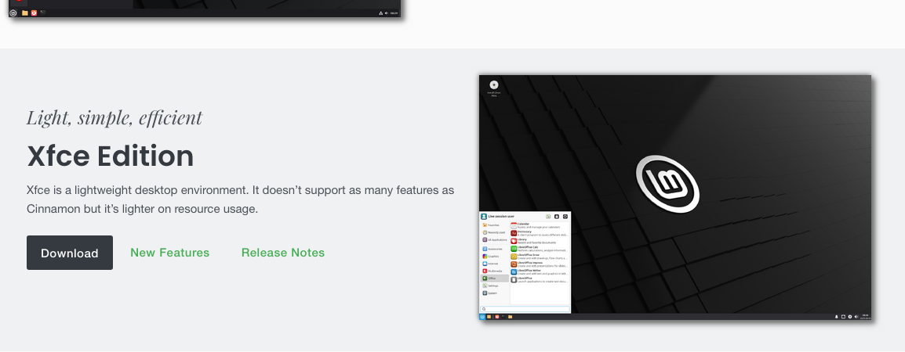
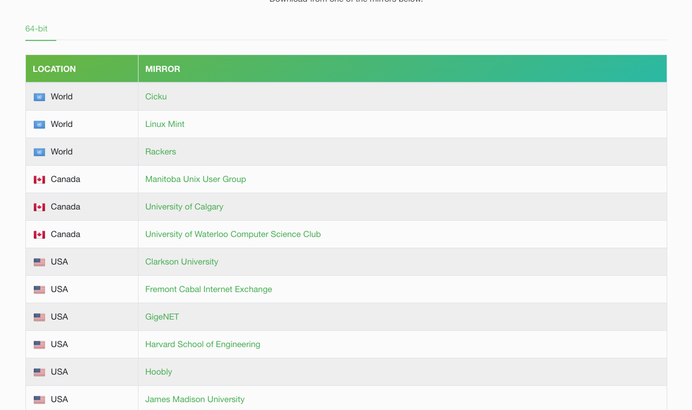
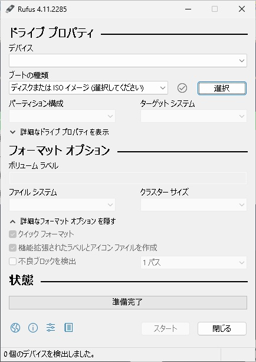

とうとう今年の 10 月にサポート切れとなってしまった Windows10。

あなたも、これまで機嫌よく動いていた PC を手放し新しく PC を購入しなくてはいけなくなった。
という状況に置かれていると思います。

1 台だけであれば、今は PC も安くなって 6〜7 万円だせは十分な性能の PC を購入できるようになりました。

1 台 2 台であれば大したこと無いかもしれません。

ですが、もしあなたが企業経営者・担当者であれば、PC の買い替えの必要性に直面し莫大な費用負担に青ざめていることでしょう。

もし Windows10 マシンをそのまま放置すると・・・

- **危機管理の甘い会社だとおもわれる:** セキュリティリスクのある会社として認識されてしまえば今のご時世ちょっとしんどいです。
- **甚大な被害を被るかも:** 最近よく耳にするランサムウエアの平均被害額は 2000 万円前後。もしウイルスの被害に遭ったら会社経営にも大きな影響が出てきかねません。
- **ちょっとカッコ悪いかも:** 取引先にも従業員からも「お金ないんじゃない？」何て思われてたりして。

などなど。心配事は尽きません。

もし低コストでセキュリティ対策バッチリの方法があれば？

そんな都合の良い話。あるはずない。って思いますよね？

実は

そんな夢のような話。あるんです。

その裏技をあなたにだけこっそり教えますね。

ただし、作業そのものは自己責任でお願いします。

くれぐれも PC を壊さないように。バックアップもしっかりとってからやってくださいね。

---

## 🛠️ セキュリティは従来以上に強固＋ Windows11 にアップグレード

実はもうすでに数社導入実績がある方法なんですが、ざっくりと以下の方法です。

- **Linux をベースにする:** 強固なセキュリティを誇る Linux をインストール
- **Linux 上で仮想化します:** 仮想化を利用し Linux の上に Windows10 マシンの内容を移す
- **アップグレードします:** 全て安全に移行できていることを確認して Winsows11 にアップグレード

たったこれだけです。

しかも、Linux 上の Winsows が万が一ランサムウエアに感染しても、昨日の状態に直ぐに戻せるので実質被害は発生しません。

果たして効果があるのかわからないランサムウエア対策に莫大なお金を使う必要なく、万全の対策を講じることができます。

---

でも何事も、

言うは易し。

さて、次からは実際にあなた自身でその対策ができるよう説明していきますね。

---

## 🛠️ 手順１　 WInsows10 マシンの内容全て　＞ VHD ファイルに

まず今使っている Windows10 マシンの内容を全て移行するためにバックアップをとりましょう。

1.  **Disk2Vhd をダウンロードする:**

    [マイクロソフトのサイト](https://learn.microsoft.com/ja-jp/sysinternals/downloads/disk2vhd) から Disk2vhd をダウンロードします。

    

2.  **Disk2Vhd を使う:**

    ダウンロードしてきた Disk2vhd.zip を解凍すると、その中に「disk2vhd64.exe」という名前のファイルがあります。（あなたの Winsows が 64 ビットという前提です）

    disk2vhd64.exe を右クリックして「管理者として実行」でプログラムを起動します。

    あ、その前に外付けの記憶装置（SSD や HDD）は外しておいてくださいね。

    このような画面が出てきます。

    

    中央から下の２つ目の白いボックス内 Volumes to include:で表示される内容な PC によって違ってきますのでご自分の環境に合わせて選択してください。

    外付けの記憶装置がない状態なら「Volume」は全部にチェック入れてください。

    右上にチェックボックスが３つ出てきますが一番上はチェックなしでいいです。

3.  **外付け SSD を接続しバックアップ:**

    元の PC のディスクより大きな SSD を準備します。

    PC に接続します。

    SSD に適当なフォルダを作成します。

    「VHD File Name」の所に SSD に作成したフォルダのパスと、これから作成する VHD ファイル名を入力します。（例：e:¥vhddata¥win10.vhd）

    「Create」ボタン押下で処理がスタートします。

    VHD 作成完了まで結構時間がかかります。

    60GB 前後で２時間程度。250GB で 8 時間ぐらいかかりました。

    VHD ファイルの作成が終わればこの画面は閉じてもらってもいいです。

---

## 🛠️ 手順 2 　 Linux をインストールする

次に Windows10 マシンを Linux マシンにしてしまいましょう。

1.  **BitLocker を OFF、BIOS を設定する:**

    Windows10 の設定画面で BitLocker を OFF にしてください。

    次に Bios ですが、Linux をインストールするには、セキュアブートを OFF にします。

    次に仮想化を許可します。

    USB メモリ からの起動を On にしておいてください。

    起動順が選択できるなら USB ドライブを優先して起動する設定にしてください。

    これらは PC によって操作が変わってきますのでここでは詳細説明できません。

    わからない場合はネットで調べてください。

2.  **Linux をダウンロードする:**

    Linux は軽量な LinuxMint をお勧めします。

    めちゃくちゃ軽いです。メモリ 2GB でサクサク動きます。

    この LinuxMint のインストール方法ですが

    まず Linux Mint の ISO ファイルをダウンロードします。

    このページに移動し

    [Linux Mint のダウンロードサイト](https://www.linuxmint.com/download.php)

    

    Xfce Edition 　を選択します。

    選択したら下のようなページに飛びますので、好きな地域からダウンロードしてください。

    

    ダウンロードが完了したら、「linuxmint-21.2-xfce-64bit.iso」というファイルができます。

    これが LinuxMint の ISO ファイルです。

3.  **USB メモリを準備しインストール用のブータブル USB にする:**

    次に USB メモリを準備してください。

    32GB ぐらいで十分でしょう。

    rufus というツールを使い、USB メモリをインストール用のブータブル USB にします。

    まず rufus の公式サイトへ Go

    [Linux Mint のダウンロードサイト](https://rufus.ie/ja/)

    rufus 公式で検索すると、偽サイトがたくさん出て来ますのでご注意を。

    公式ページで　 Download をクリックするとこのような位置までジャンプしてくれます。

    

    文字化けしてますね。すみません。 Mac で編集しているからかな？

    気を取り直して。

    Windows x64 標準：を選択。ふつうはこれで OK ですが portable でも大丈夫です。

    ダウンロードしたファイルを起動するとこのような画面が出ます。

    

    次のような操作でブータブル USB を作成します。

    1.  **Rufus を起動**します。（インストール不要でそのまま使えます）
    2.  **デバイス (Device)**: 用意した USB メモリが正しく選択されているか確認します。
    3.  **ブートの選択 (Boot selection)**: 「**選択**」ボタンをクリックし、ダウンロードした **Linux Mint の ISO ファイル**を選択します。
    4.  **パーティション構成 (Partition scheme)**: **GPT** を選択します。
        - （最近の PC の起動方式である**UEFI**での起動に対応するためです。）
    5.  **ターゲットシステム (Target system)**: **UEFI (非 CSM)** を選択します。
    6.  その他の設定（ボリュームラベルなど）はデフォルトのままで問題ありません。
    7.  「**スタート**」をクリックします。
    8.  警告が出ますが、「**OK**」を押して書き込みを開始します。
    9.  書き込みが完了したら、**ブータブル USB の完成**です。

    セキュアブートが Off にできない時の裏技:

    もしセキュアブートが Off にできない場合は、Ventoy というツールを使って USB を作成してください。セキュアブート Off にしてなくても起動できる強力な USB メモリが作成できます。

4.  **Linux Mint の起動:**

    1.  ブータブル USB を PC に接続したまま、PC を再起動します。
    2.  USB から起動すると、Linux Mint の起動メニューが表示されます。
    3.  メニューの一番上にある「**Start Linux Mint**」を選択して、Enter キーを押します。
    4.  しばらく待つと、Linux Mint のデスクトップ画面が表示されます。
    5.  デスクトップ上の 「Install Linux Mint」 アイコンをダブルクリックして、インストーラーを起動します。
    6.  言語（日本語）を選択し、「続ける」をクリックします。
    7.  キーボードレイアウトを選択します。
    8.  サードパーティ製ソフトウェア（Wi-Fi、グラフィック、メディアコーデックなど）のインストールにチェックを入れます。（推奨）
    9.  インストールの種類を選択します。「ディスクを消去して Linux Mint をインストール」を選択します。（HDD/SSD の全データが消去されます）
    10. 地域（タイムゾーン）、ユーザー名とパスワードを設定します。
    11. 「インストール」をクリックします。

インストールが完了したら、PC を再起動し、USB メモリを抜いてください。再起動後、Linux Mint が起動すれば完了です。

---

## 🛠️ 次の手順

ここまで来ればぼぼ出来た。と言ってしまっても過言ではないでしょう。

あとは仮想環境の構築と、Windows11 へのアップグレードだけです。

長くなってしまったので続きは続編にて。

ではでは。
